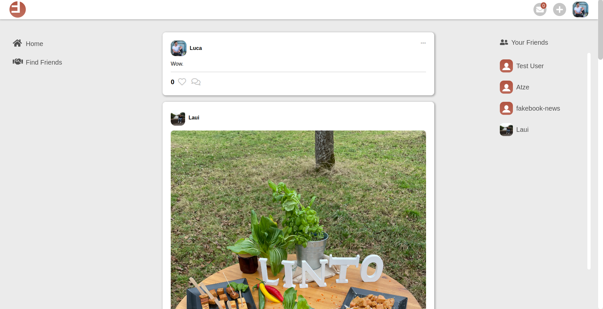

# fakebook

## Description
A project to test and sharpen my skills on a bigger rails project. 
The project is a facebook clone containing following features:
<ul>
  <li>text and image posts</li>
  <li> comments </li>
  <li> likes </li>
  <li> friendships </li>
  <li> profile pages </li>
  <li> profile pictures </li>
  <li> profile biography </li>
  <li> find friend page with searchbar </li>
  <li> more alive and reactiv thanks to Turbo Frames, Turbo Streams and Stimulus </li>
</ul>

## Demo
Link to [fakebook](https://still-spire-52928.herokuapp.com/)  
note: it takes about 30 seconds for heroku to load the webapp.

### Demo test users
E-Mail: test@test.com 
Password: 123456

## Screenshots

 

 

 

 

